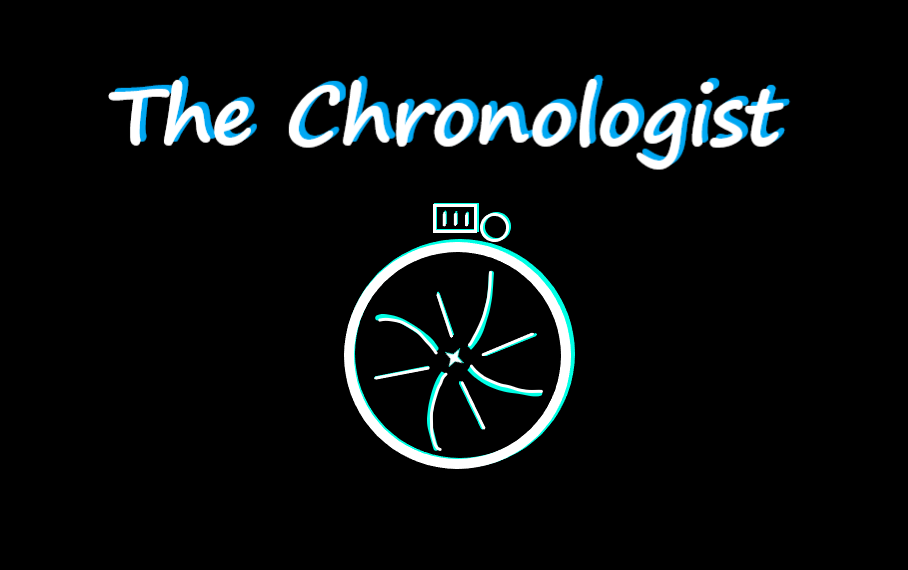
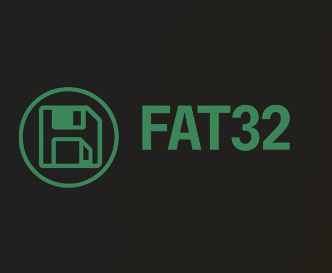
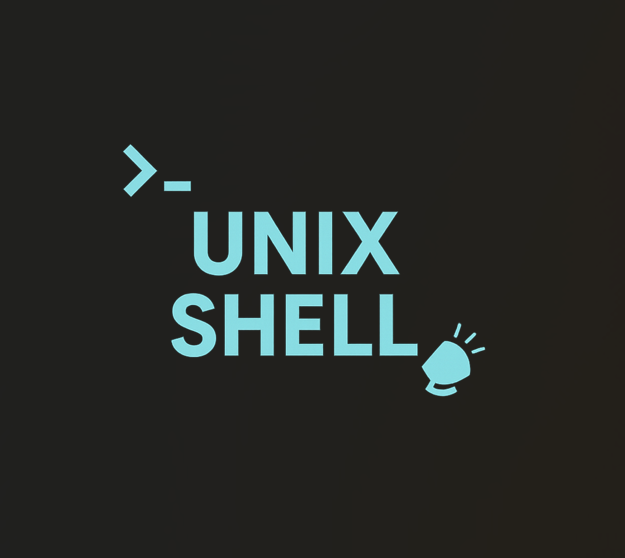
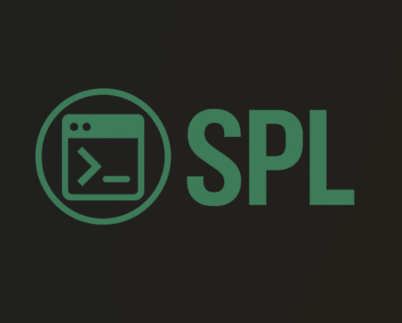

<!-- Header -->
<h1 align="left">🚀 Hello World! I'm Nooraldeen Alsmady</h1>
🎓 CS Student @ UTA | 🤖 Machine Learning & AI | 🌐 Web & App Dev | 🔒 Cybersecurity Enthusiast  

## ⚡ About Me
- 🎓 Senior CS student @ **University of Texas at Arlington**, graduating **Dec 2025**  
- 🤖 Obsessed with **Machine Learning & AI** — teaching machines to think, learn, and adapt  
- 🌐 Passionate about **Web Development** (front + back) & 📱 **App Development** (Android & beyond)  
- 🔒 Curious explorer of **Cybersecurity** — love digging into system defenses & vulnerabilities  
- 🛠️ **I build things**: from software systems to apps & tools that make life easier  
- 🔥 Hungry to **learn, grow, and push boundaries** — I want to leave an impact with every project I touch  
- 💪 Outside of code: you’ll find me at the **gym 🏋️, cooking 👨‍🍳, or running 🏃‍♂️** to stay sharp  

### 🌐 Socials

  
  
  

---

### 🧰 Tech Stack

  
  
  
  
  
  
  
  
  
  
  
  
  
  
  
  

---

### 🚀 projects

<table style="width:100%; border-collapse:separate; border-spacing:20px;">

  <!-- Row 1 -->
  <tr>
    <!-- BestPrice Store -->
    <td width="50%" valign="top">
      

        
        <h3 style="margin:15px 0 8px;">🛒 BestPriceStore: Database & Website</h3>
        
<a href="https://github.com/nooraldeen00/Best-Price-Groceries">🔗 <u>Check it out</u></a>

        
A web-based inventory & vendor management system backed by a normalized SQL database and PHP interface.

        
<b>Role:</b> Full-Stack Developer

        

          
          
          
        

      

    </td>

    <!-- The Chronologist -->
    <td width="50%" valign="top">
      

        
        <h3 style="margin:15px 0 8px;">🎮 The Chronologist</h3>
        
<a href="https://github.com/nooraldeen00/The-Chronologist">🔗 <u>Check it out</u></a>

        
A puzzle-platformer that bends time and gravity to create unique mechanics that test logic and creativity.

        
<b>Role:</b> Game Developer (Mechanics & Level Design)

        

          
          
        

      

    </td>
  </tr>

  <!-- Row 2 -->
  <tr>
    <!-- FAT32 Shell -->
    <td width="50%" valign="top">
      

        
        <h3 style="margin:15px 0 8px;">📂 FAT32 File System Shell</h3>
        
<a href="https://github.com/nooraldeen00/FAT32">🔗 <u>Check it out</u></a>

        
User-space shell in C to explore FAT32 images with commands like <code>ls</code>, <code>cd</code>, <code>stat</code>, <code>get</code>, <code>put</code>.

        
<b>Role:</b> Systems Programmer

        

          
          
        

      

    </td>

    <!-- Unix Shell -->
    <td width="50%" valign="top">
      

        
        <h3 style="margin:15px 0 8px;">💻 Unix Shell (msh)</h3>
        
<a href="https://github.com/nooraldeen00/Unix-Shell">🔗 <u>Check it out</u></a>

        
A mini-shell in C with interactive & batch modes, redirection, and process control (<code>fork</code>, <code>exec</code>, <code>wait</code>).

        
<b>Role:</b> Systems Programmer

        

          
          
        

      

    </td>
  </tr>

  <!-- Row 3 -->
  <tr>
    <!-- Custom Allocator -->
    <td width="50%" valign="top">
      

        
        <h3 style="margin:15px 0 8px;">🧠 Custom Memory Allocator</h3>
        
<a href="https://github.com/nooraldeen00/Custom-Allocator">🔗 <u>Check it out</u></a>

        
A <code>malloc/free</code> replacement with Next Fit, Best Fit, Worst Fit + <code>realloc</code> & <code>calloc</code> benchmarks.

        
<b>Role:</b> Systems Programmer

        

          
          
        

      

    </td>

    <!-- SPL Compiler -->
    <td width="50%" valign="top">
      

        
        <h3 style="margin:15px 0 8px;">⚙️ SPL Compiler</h3>
        
<a href="https://github.com/nooraldeen00/SPL-Compiler">🔗 <u>Check it out</u></a>

        
Custom compiler pipeline: JFlex scanner → CUP parser → AST → type checker → IR → MIPS assembly.

        
<b>Role:</b> Compiler Engineer

        

          
          
          
        

      

    </td>
  </tr>

</table>

### 🧠 Random Dev Quote

### 📊 GitHub Stats

### 📝 Contact
- 📧 Email: nooraldeenalsmady@gmail.com  
- 🌐 Portfolio: nooraldeenalsmady.com  

